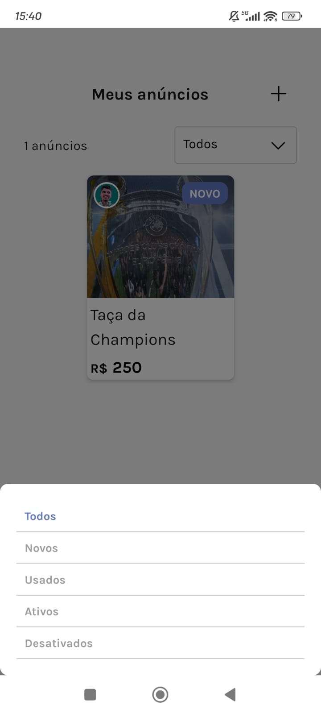

# Marketspace

  

<h2>Descrição</h2>

Marketspace é uma aplicação de compra e venda de produtos online, similar a OLX. 

    
    
    

    
    
    

    
    
    

    
    
    

<h3>Origem</h3>

Este é um desafio opcional da trilha Reac Native da Rocketseat.

<a href="https://www.figma.com/design/0g7l1dIbRx0j29Pb5dKqfP/Marketspace-%E2%80%A2-Desafio-React-Native-(Copy)?t=GQjaq0Q1uLG75u5N-0">Layout Figma do Projeto</a>

<h2> Principais tecnologias envolvidas </h2>

- Typescript
- Nodejs
- Prisma
- React Native
- Expo
- Native-base
- React Router
- React Hook Form
- React Native Async Storage

